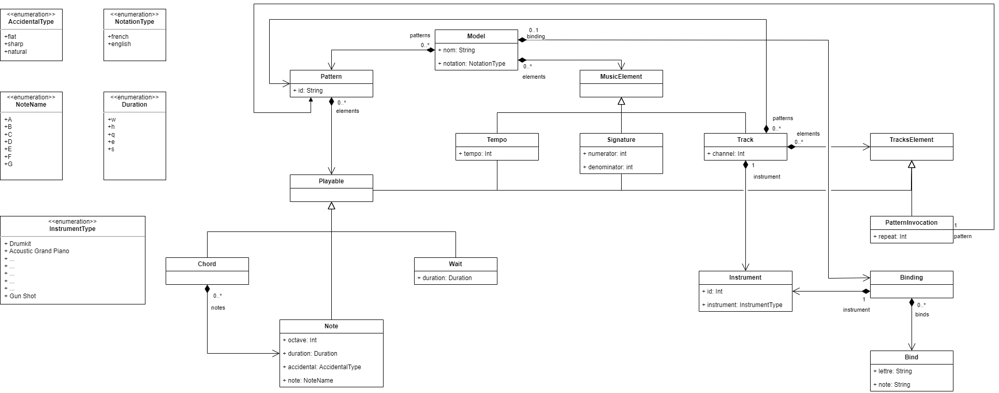

\newpage 
\vspace*{\fill}
\begin{center}
\Huge MusicML\\[0.5em]
\Large Rapport de projet - Domain Specific Language\\[2em]
\LARGE \textbf{Groupe Désolation} \\[0.5em]
\Large \textbf{21/01/2024} \\[5em]
\large \href{https://github.com/ThomasFarineau/}{Thomas FARINEAU} \\[0.5em]
\large \href{https://github.com/LeoKitabdjian}{Léo KITABADJIAN} \\[0.5em]
\large \href{https://github.com/Ludovic-BAILET}{Ludovic BAILET} \\[0.5em]
\large \href{https://github.com/Yaplupile}{Mohamed MAHJOUB} \\[5em]
\normalsize https://github.com/ThomasFarineau/pns-si5-dsl-lab2-desolation
\end{center}
\vspace*{\fill} 
\newpage

\renewcommand*\contentsname{Table des matières}
\tableofcontents

\newpage

\section{Introduction}

Ce projet se concentre sur la création d'un DSL (Domain Specific Language) destiné à faciliter la composition musicale. Ce DSL offre une interface intuitive pour la création de pièces musicales, en mettant l'accent sur la flexibilité et la simplicité. Il permet aux compositeurs de définir des pistes, des notes et des éléments de batterie dans un cadre temporel précis. Chaque piste représente une séquence de notes, tandis que le temps est organisé en signatures, mesures, battements et tics. Notre DSL prend également en charge le tempo, permettant aux compositeurs de contrôler la dynamique de leur musique.

L'une de ses caractéristiques notables est la gestion des pistes de batterie, où chaque élément de batterie est associé à une note MIDI spécifique. En résumé, notre projet vise à simplifier le processus de composition musicale en offrant un outil flexible et intuitif pour l'expression artistique. Les détails de son fonctionnement seront explorés plus en profondeur dans les sections suivantes.

\section{Description du langage}

\subsection{Modèle de domaine}

_L'image est cliquable pour pouvoir zoomer sur les différents points du modèle de domaine._  
[](https://raw.githubusercontent.com/ThomasFarineau/pns-si5-dsl-lab2-desolation/main/docs/domain_model.png?raw=true)

\subsection{Syntaxe concrète sous forme BNF}

```xml
<Model> ::= 'name' <Name> 'notation' <Notation> { <Pattern> }* [ <Bindings> ] { <MusicElement> }*
<Name> ::= 'name' <STRING>
<Notation> ::= 'notation' ( 'NOTATION_LATIN' | 'NOTATION_ENGLISH' | 'NOTATION_GERMAN' )
<Tempo> ::= 'tempo' <INT>
<Signature> ::= 'signature' <INT> '/' <INT>
<Instrument> ::= 'instrument' <ID>
<Channel> ::= 'channel' <INT>
<Bindings> ::= 'bindings' '{' <Instrument> { <Binds> }* '}'
<Binds> ::= 'bind' <LETTER> <BINDING_NOTE>
<Track> ::= 'track' '{' <Instrument> [ <Channel> ] { <Pattern> }* { <TrackElement> }* '}'
<Pattern> ::= 'pattern' <ID> '{' { <Playable> }+ '}'
<PatternInvocation> ::= 'play' <INT> <Pattern>
<MusicElement> ::= <Tempo> | <Signature> | <Track>
<Playable> ::= { ( <NOTE> | <DRUMKIT_NOTE> | <SEPARATOR> | <CHORD_OPENER> | <CHORD_CLOSER> ) }+
<TrackElement> ::= <PatternInvocation> | <Playable> | <Tempo> | <Signature>

<NOTATION_ENGLISH> ::= 'english'
<NOTATION_LATIN> ::= 'latin'
<NOTATION_GERMAN> ::= 'german'

<SEPARATOR> ::= '|' <NOTE_DURATION>?
<DRUMKIT_NOTE> ::= ( 'bd' | 'sd' | 'ch' | 'oh' | 'cc' | 'rc' )

<ENGLISH_NOTES> ::= 'C' | 'D' | 'E' | 'F' | 'G' | 'A' | 'B'
<LATIN_NOTES> ::= 'Do' | 'Re' | 'Mi' | 'Fa' | 'Sol' | 'La' | 'Si' | 'Ut'
<GERMAN_NOTES> ::= 'C' | 'D' | 'E' | 'F' | 'G' | 'A' | 'H'

<NOTE_DURATION_BASE> ::= 'w' | 'h' | 'ts' | 'sf' | 's' | 'q' | 'e'
<NOTE_DURATION_PLUS> ::= 'dh'|'ddh'|'qt'|'dq'|'ddq'|'et'|'de'|'dde'|'st'
<NOTE_DURATION> ::= ( <NOTE_DURATION_PLUS> | <NOTE_DURATION_BASE> )
<NOTE_OCTAVE> ::= /[0-9]/
<NOTE_A_SHARP> ::= '#'
<NOTE_A_FLAT> ::= 'b'
<NOTE> ::= ( <ENGLISH_NOTES> | <LATIN_NOTES> | <GERMAN_NOTES> ) 
    ( <NOTE_A_SHARP> | <NOTE_A_FLAT> )? <NOTE_OCTAVE> <NOTE_DURATION>
<CHORD_OPENER> ::= '['
<CHORD_CLOSER> ::= ']'
<BINDING_NOTE> ::= (ENGLISH_NOTES | LATIN_NOTES | GERMAN_NOTES) 
    (NOTE_A_SHARP | NOTE_A_FLAT)? NOTE_OCTAVE;
    
<ID> ::= /[_a-zA-Z][\w_]*/
<INT> ::= /[0-9]+/
<STRING> ::= /"[^"]*"/
<LETTER> ::= /'[a-zA-Z]'/
```

\subsection{Description du langage}

MusicML est un langage spécifique au domaine musical, conçu pour simplifier la création de compositions musicales grâce à une syntaxe intuitive et flexible. Il se concentre sur la facilité d'expression musical en permettant aux utilisateurs de définir des éléments essentiels tels que des notes, des patterns et des pistes de manière organisée. MusicML offre des abstractions claires pour des concepts musicaux complexes, facilitant ainsi la composition musicale.

Ce langage propose une structure claire pour la composition musicale, permettant aux compositeurs de définir le nom de la composition, la notation musicale (latin, english ou german), et de créer des patterns réutilisables. Les compositions sont structurées en éléments clés tels que le tempo, la signature rythmique et les pistes, chacun pouvant être personnalisé en fonction des besoins du compositeur.

Les pistes sont un élément central de MusicML, chacune dispose son propre instrument, et potentiellement, un canal MIDI et des patterns uniques. Les compositeurs peuvent invoquer des patterns (issu de la musique ou de la piste) dans les pistes avec une fréquence de répétition spécifiée, ce qui facilite la création de compositions cohérentes et structurées.

Les instructions de musique décrivent les notes, les accords, les pauses et les rythmes de la composition. Les compositeurs peuvent utiliser différentes notations pour représenter ces éléments, en fonction de leurs préférences. MusicML prend en charge une gamme diversifiée d'instruments, des instruments traditionnels aux instruments électroniques, offrant ainsi une variété d'options pour l'expression musicale.

La durée des éléments musicaux est spécifiée à l'aide de symboles tels que "w" (noire), "h" (blanche), "q" (croche) et d'autres, permettant ainsi de créer des motifs rythmiques complexes. Les accords, les notes de batterie et les pauses sont également pris en charge, offrant une variété d'expressions musicales.

MusicML offre également la possibilité de générer des fichiers JSON à partir des compositions, ce qui facilite le débogage et la visualisation des détails de la composition. Cela permet aux compositeurs de vérifier le contenu musical de manière pratique, même si les fichiers JSON générés sont assez longs.

En résumé, MusicML est un langage spécifique au domaine musical qui simplifie la composition musicale en offrant une syntaxe intuitive, une structure claire et une variété d'options pour l'expression musicale. Il permet aux compositeurs de créer des compositions cohérentes et personnalisées, que ce soit pour des compositions simples ou complexes, tout en offrant des outils de débogage pratiques pour le processus de création musicale.

\subsubsection{User Acceptance}

Dans le but de rendre notre application plus user-friendly nous avons décidé de mettre en place 2 éléments pour les utilisateurs :
- Un système de validateur compatbile avec VScode qui permet de donner du feedback à l'utilisateur en direct sur les valeurs entrées dans le fichier. Par exemple, il sera informé si le nom de l'instrument est invalide ou si l'utilisateur écrit des notes incompatibles avec un instrument (notes classiques pour une batterie par exemple) ou alors écrites dans une notation différente de celle définie précédemment (english/latin/etc...), et d'autres fonctionnalités.
- Un serveur web qui permet de visualiser et de jouer en direct la musique créée par notre DSL. Il peut afficher toutes les tracks indépendamment et la partition complète avec toutes les notes sur un lecteur. De plus, ce serveur web nous a permis d'implémenter notre extension.

\subsubsection{Extension : User input}

Nous avons choisi d'implémenter l'extension User Input. Pour cela, nous avons modifié la syntaxe de notre DSL pour y ajouter la notion de bindings. L'utilisateur définit donc un instrument ainsi qu'une liste de bindings avec une lettre du clavier suivie d'une note. Ainsi, lorsque l'on se rend sur la page web on peut, en même temps que la musique se joue, jouer les notes définies précédemment sur l'instrument choisi. On peut jouer plusieurs notes à la fois et les notes sont allongées tant que l'utilisateur ne relâche pas la touche, après quoi la note s'arrête.

Pour le moment, on ne permet de définir qu'un instrument pour tous les bindings. Une amélioration serait de permettre de définir des instruments différents pour certains bindings (par exemple la lettre 'a' en piano mais la lettre 'r' en violon). De plus, on ne gère pas encore les notes liées à la batterie (ch, bd, sd, etc...).

\subsubsection{Mise en oeuvre}

La mise en œuvre de MusicML se réalise grâce à une approche logicielle, reposant sur Node.js (version 18.4.0 minimum) et un système d'exploitation Linux (ou Windows avec quelques limitations, en utilisant WSL pour l'exécution des scripts).

Pour mettre en œuvre MusicML, vous devez suivre les étapes suivantes :

1. **Clonage du Projet :** La première étape consiste à cloner le projet `pns-si5-dsl-lab2-desolation` à partir du repo GitHub. Cela peut être réalisé en utilisant la commande git clone suivie de l'URL du référentiel, comme indiqué dans le [README](https://github.com/ThomasFarineau/pns-si5-dsl-lab2-desolation/blob/main/README.md). Cette action télécharge tous les fichiers et scripts nécessaires localement.

2. **Préparation de l'Environnement :** Après le clonage du projet, l'étape suivante est la préparation de l'environnement. Pour ce faire, exécutez le script prepare.sh à l'aide de la commande `sh prepare.sh`. Ce script se charge de mettre en place les dépendances nécessaires et de préparer l'environnement de travail.

3. **Utilisation :** Une fois que l'environnement est prêt, vous pouvez commencer à utiliser MusicML pour composer de la musique. Utilisez la commande sh run.sh en spécifiant le chemin vers le fichier MML que vous souhaitez convertir en fichier MIDI. Vous pouvez également utiliser des options facultatives telles que -d pour spécifier le dossier de destination, -j pour générer un fichier JSON, -w pour ouvrir un serveur web pour l'écoute, et -mt pour afficher les pistes multiples sur le serveur web.

4. **Exemples :** Le [README](https://github.com/ThomasFarineau/pns-si5-dsl-lab2-desolation/blob/main/README.md) propose des exemples d'utilisation pour illustrer comment composer des morceaux musicaux avec MusicML. Vous pouvez vous référer à ces exemples pour comprendre comment utiliser efficacement le langage.

5. **Documentation :** Pour une mise en œuvre plus avancée, la documentation fournie dans le [README](https://github.com/ThomasFarineau/pns-si5-dsl-lab2-desolation/blob/main/README.md) explique en détail la syntaxe du langage MusicML, les éléments de composition, les instructions de musique, les notations disponibles et les instruments pris en charge. Cette documentation est essentielle pour créer des compositions complexes et personnalisées.

https://github.com/ThomasFarineau/pns-si5-dsl-lab2-desolation/blob/main/README.md

\section{Scénarios mis en œuvre}

Scénario 1 : Billie Jean - Michael Jackson
Ce scénario met en place les fonctionnalités de base de notre DSL. Il nous permet de montrer l'utilisation de patterns simples et l'utilisation des différentes Tracks. Il met également en avant les accords et les "pauses" utilisées.

Scénario 2 : Moonlight Sonata
Ce scénario met en place des fonctionnalités plus avancées de notre DSL. Il nous montre l'utilisation de notes plus complexes avec des durées plus particulières que les simples notes noires.

Scénario 3 : Tempo and Sig switch
Ce scénario met en place des fonctionnalités plus avancées de notre DSL. Il nous montre la possibilité de changer de tempo et de signature en plein milieu d'une track, passant, par exemple, d'une signature 4/4 avec un tempo lent à une valse en 3/4 avec un tempo plus rapide.

\section{Analyse critique}

On peut analyser notre BNF en le séparant en 2 parties principales.

Nous avons tout d'abord une partie "composition". Cette section nous permet d'éditer les pistes qui peuvent être utilisées par plusieurs pistes pour des instruments différents. Elle contient également le nom de la musique et la notation utilisée pour celle-ci dans le futur (Do, Re, Mi... / A, B, C...). Il est aussi possible de déclarer un tempo et une signature globale pour toutes les futures pistes audio.

Une fois la composition terminée, nous arrivons sur la partie "édition". Celle-ci nous permet de définir les différentes pistes avec les instruments joués dans celles-ci et les patterns "composés" que l'on souhaite jouer. Il est aussi possible de créer de nouveaux patterns dans les pistes, ils seront donc locaux à celles-ci et ne pourront pas être joués ailleurs. Il est important de noter qu'il est possible de changer dans chaque piste le tempo et la signature de celle-ci. Il nous est possible d'avoir des changements de tempo et de signature à n'importe quel moment grâce à notre BNF qui indique que la source (TrackElements) de ces changements est la même que celle des notes. Il est possible, à la place d'une note, à n'importe quel moment, de changer la signature ou le tempo de notre musique.
Enfin, il est aussi possible de définir des Bindings. Ceci sert à la fonctionnalité de la carte qui nous permet de définir des touches pour les lier à des notes.

\subsection{Mise en œuvre du DSL par rapport au cas d'utilisation MusicML}

\subsection{Technologie choisie pour la mise en œuvre du DSL}

Pour rédiger notre DSL, nous avons d'abord choisi d'utiliser Langium. Pour notre kernel, nous avons opté pour l'écriture en TypeScript. Nous avons choisi Langium pour notre DSL car il simplifie les choses en fournissant des outils qui permettent de générer le langage de manière simple en utilisant la BNF. Nous avons choisi TypeScript comme langage pour le kernel afin d'optimiser la collaboration entre notre kernel et Langium. De plus, nous l'avons également choisi pour les ressources qu'il offre dans l'écriture de fichiers MIDI simplifiée à l'aide de librairies.


\section{Responsabilités de chaque membre}

- **Thomas FARINEAU**
  - Mise en place du kernel
    - Mise en place de la structure du projet
      - Parsing des données reçues sur le kernel
      - Implémentation de Midi Writer JS
    - Tests sur la structure
    - Mise en place du serveur Web pour l'écoute des fichiers MIDI
      - Conception de l'interface Web de A à Z
      - Mise en place de l'affichage multi-pistes
  - Mise en place du projet Langium
     - Mise en place de la grammaire
       - Écriture au format BNF
     - Mise en place des validateurs
     - Mise en place des générateurs
     - Tests sur la grammaire
     - Tests sur les validateurs
     - Tests sur les générateurs


- **Léo KITABDJIAN**
   - Mise en place de la structure du projet
     - Parsing des données reçues sur le kernel
     - Implémentation de Midi Writer JS
       - Construction du modèle de données et mise en place des éléments dans Midi Writer
         - Tempo / Signature / Note / Accord / Silence
       - Tests de Midi Writer JS
   - Mise en place de l'extension
     - Modification de la syntaxe et du validateur du DSL
     - Parsing des nouvelles données dans le kernel
     - Récupération des bindings sur la page web
     - Mise en place du système permettant de jouer des notes avec les bindings


- **Ludovic BAILET**
  - Implémentation initial du projet langium
  - Réalisation du diagramme de classe et du domaine model
  - Réalisation de la première grammaire langium

    
- **Mohamed MAHJOUB**
  - Diagramme de classe du modèle de domaine
