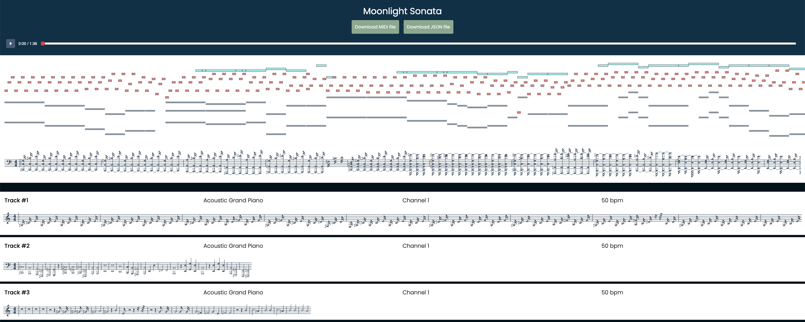

```bash
pandoc rapport.md -o rapport.pdf
```

### Comment démarer notre projet

- Ouvrez un terminal à l'endroit où vous avez cloné le projet.
- Lancer le scripte de préparation (il peut prendre quelques minutes à s'exécuter).
Ce script va construire le kernel puis générer et construire le projet Langium.
```bash
sh prepare.sh
```
Une fois la préparation effectuée, vous pouvez désormais générer des fichiers midi grâce à notre langage DSL.

### Comment généré un fichier .mid

- Pour commencer, vous devez créer un fichier finissant par l'extension .mml respectant notre DSL.
(Deux fichiers d'exemples se situe dans le répertoire [samples](https://github.com/ThomasFarineau/pns-si5-dsl-lab2-desolation/tree/main/samples)
- Une fois votre fichier créé, vous pouvez générer votre fichier midi en exécutant le script run.sh.
```bash
sh run.sh ./samples/billie_jean.mml
```
-  Cette action a pour objectif de générer le fichier billie_jean.mid dans le répertoire [generated](https://github.com/ThomasFarineau/pns-si5-dsl-lab2-desolation/tree/main/generated)

### Les différentes options possibles

Le script run.sh dispose de 4 options lors de son exécution
|        Nom         | Description|
|--------------------|----------------------------------------|
| -j, --json         | Crée une version json de votre fichier |
| -w, --web          | Crée un lien vers lequel vous pourrez visualiser et écouter ce que vous avez créé |
| -mt, --multi-track | Affiche les différentes track si vous utilisez la visualisation web |
| -d, --destination  | Change le dossier dans lequel vos fichiers vont être générés (par défaut [generated](https://github.com/ThomasFarineau/pns-si5-dsl-lab2-desolation/tree/main/generated/) |



